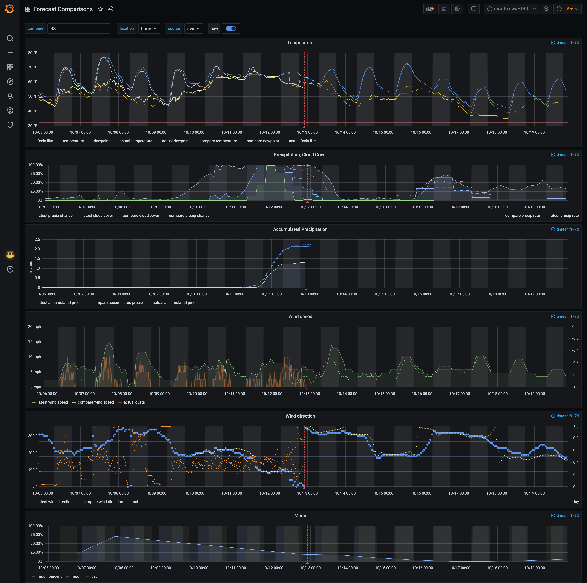
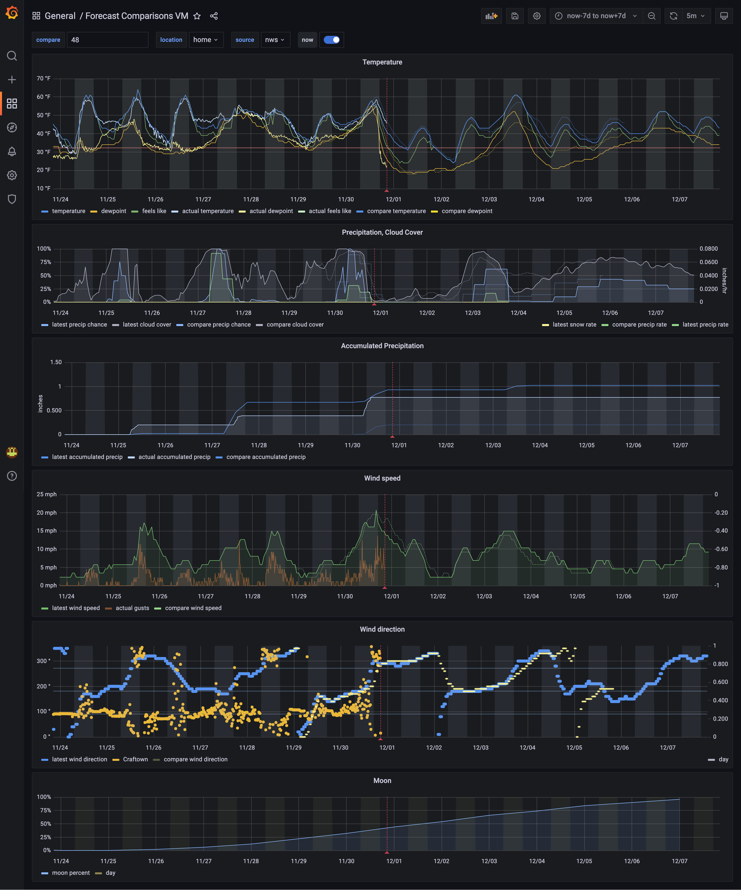

# ForecastMetrics

ForecastMetrics is a tool to store forecast data from multiple
sources in VictoriaMetrics or InfluxDB.

Features:
- Hourly forecast updates written to Influx or VictoriaMetrics for multiple locations
- Http server implementing the prometheus `query_range` endpoint, allowing it to be
  used as a Prometheus data source for adhoc forecasts in Grafana.

I currently use [VictoriaMetrics](https://victoriametrics.com) as my time series database.
Because of that, this project does a few things specifically to support it:
- Writes hourly sunup information
- Uses no retention policies (not supported in VictoriaMetrics)
- No overwrite of metrics
  - Every forecast is a new tag/label, since VictoriaMetrics doesn't support overwriting
    metrics as Influx does.
  - Past data is written one data point per hour, also because overwriting data is unsupported.
  - An alternative mode can be enabled by setting `overwrite_data` to `true`
    in the config file. In this mode, there will only be one forecast series per source/location. 

#### Currently supported sources:
- National Weather Service (NWS) (US-only)
- VisualCrossing (Global)
- No other sources planned at this time, due to not meeting the below
criteria (7 day hourly forecast, reasonably priced or free)
- Open an issue if you find a worthy source!

## Usage:

### Install
- Download a binary from the latest [Release][release] if your architecture is available

      curl -O https://github.com/tedpearson/ForecastMetrics/releases/download/v4.1.0/forecastmetrics-linux-arm64

- Make the binary executable

      chmod +x forecastmetrics-linux-arm64

- If your architecture is not avaialable, you'll need to build from source:
  - Clone this repo
  - [Install Go][install-go]
  -
        cd ForecastMetrics
        go build

### Config

- Get the example application and location configs: 

      curl https://raw.githubusercontent.com/tedpearson/ForecastMetrics/master/forecastmetrics.example.yaml > forecastmetrics.yaml
      curl https://raw.githubusercontent.com/tedpearson/ForecastMetrics/master/locations.example.yaml > locations.yaml

- Modify the configs with your own values for:
  - locations
  - influxdb/victoriametrics connection
    - if using influxdb, you may set `overwrite_data` to `true`, creating only a single series for each source/location.
  - desired influx measurement names (metrics prefixes for victoriametrics)
  - which weather sources to enable
  - add your own key for Visualcrossing, if desired
  - server config for ad-hoc forecasts:
    - Set the port the server should listen on (set to `0` to disable the server)
    - Insert your own [Bing Maps Location API token][bing-token]

### Ad-hoc Forecasts Setup

Since version 4.0, ForecastMetrics supports use as a prometheus data source in grafana for getting
ad-hoc weather forecasts for any location.

- Only simple queries are supported, no functions or other features
- Queries should look like this: `forecast_metricname{source="nws",location="place"}`
- The `location` tag supports these formats:
  - place name 
  - lat,lon
  - place name|nickname
  - lat,lon|nickname
- An optional tag `save` is also supported. if `save="true"`, ForecastMetrics will add it to
  locations.yaml and update the metric every hour.
  - The locations.yaml file needs to be writable by the user running the process for this to work.
- To add as a data source to Grafana, add as a Prometheus data source. When you save, there will be an error
  about "404 Not Found - There was an error returned querying the Prometheus API." You can ignore this error
  and proceed to configuring a dashboard.

### Run
Run the binary like this:

    ./forecastmetrics --config forecastmetrics.yaml --locations locations.yaml

## Grafana Dashboard
I've included definitions for my grafana dashboard in the repo, both for [InfluxDB](grafana/influx.json) and
[VictoriaMetrics](grafana/victoriametrics.json) which I now use. Here are screenshots of each in use. I use
this dashboard daily for my local weather forecast.

### Influx Dashboard 

### VictoriaMetrics Dashboard

## Rationale behind included/planned sources:
I was looking for a replacement for DarkSky, who were bought by
Apple and retired their API in <s>2021</s> <s>2022</s> 2023.
DarkSky had the best forecasts and a generous free version,
with 7 days of forecast data available.

I used the DarkSky data to power my own visualizations of my
local forecast in Grafana. I find my Grafana graphs of forecast
data much more intuitive than any weather app or website out there.
I display the 7 day forecast for temps, precip, wind, and clouds,
on the same graph with 7 days of actual data history from my
Ambient Weather personal weather station, and also the forecast
from 24 hours previous. (You can find my Ambient Weather exporter
[here][ambientweatherexporter].)

So when I went looking for replacements I needed these features:
- At least 7 days of HOURLY forecast data. Daily highs and lows
are not very interesting to look at in a graph.
- I preferred Free APIs or APIs allowing at least 1500 forecasts
per month, as I only made <200 calls/day to DarkSky, and paying
large amounts for my personal forecast dashboard is just silly.
  - This is why visualcrossing is a supported source,
  because their free tier supports 250 forecasts/day.

[release]: https://github.com/tedpearson/ForecastMetrics/releases
[config-example]: https://github.com/tedpearson/ForecastMetrics/blob/master/config/forecastmetrics.example.yaml
[install-go]: https://golang.org/dl/
[bing-token]: https://learn.microsoft.com/en-us/bingmaps/getting-started/bing-maps-dev-center-help/getting-a-bing-maps-key
[ambientweatherexporter]: https://github.com/tedpearson/ambientweatherexporter